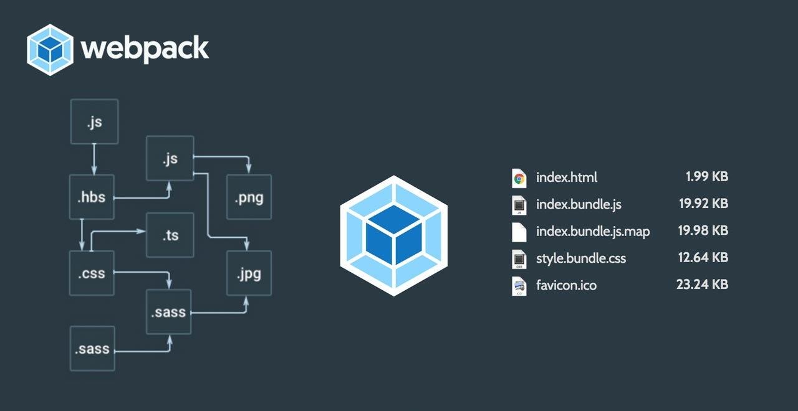

  <h1>Webpack Project</h1>

## Project Information

### Resources
- Read or watch:
  - [Webpack Documentation](https://webpack.js.org/concepts/)
  - [Webpack Beginner Guide](https://webpack.js.org/guides/getting-started/)
  - [npm-package.json](https://docs.npmjs.com/cli/v7/configuring-npm/package-json)

### Learning Objectives :brain:
By the end of this project, you should be able to explain:
- How to set up Webpack for a basic project
- Entry points, output, and loaders in Webpack
- Adding plugins and splitting code into chunks
- Setting up a development server with Webpack

### Requirements :bangbang:
- All code will be executed on Ubuntu 18.04 LTS using Node 12.x.x
- All files should end with a new line

## Tasks Overview :computer:

### Task 0: Basic Setup
- Set up Webpack and jQuery for a basic project.
- Generate a dist folder with HTML and JavaScript files.
- Ensure error-free console output when opening the main file.

### Task 1: Learning with Config File
- Use a webpack.config.js file for custom configurations.
- Add functionality using jQuery and Lodash.
- Prevent spam with a debouncing function.

### Task 2: Adding CSS & Images
- Modify Webpack to support CSS and images.
- Optimize image handling within the bundle.
- Maintain error-free console when opening the main file.

### Task 3: Dev Servers, Modules, and Tree Shaking
- Setup a development server with Webpack.
- Modularize code into header, body, and footer.
- Optimize bundle size and improve development speed.

## Repositories
- **GitHub Repository:** [holbertonschool-web_react](https://github.com/holbertonschool-web_react)
- **Directory:** Webpack

---

**Author:** Simon RICHARD  
**LinkedIn:** [simonrichard-dev](https://www.linkedin.com/in/simonrichard-dev/)
